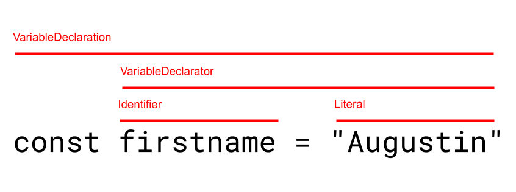

This is the write up of a talk I gave at [Paris.js #84](https://parisjs.org/meetup/2019-04-24). The slides can be found [there](https://github.com/AugustinLF/talk-codemods-paris-js). And if you prefer a video of me going through this topic, in French, here's the [link](https://www.youtube.com/watch?v=sWN7b4g_HMg).

## Codemods

What is a codemod? You execute a script, it checks all the files of your codebase, and if it matches conditions you defined, it'll update these files.

You can use codemods for a lot of things. Here are a couple of codemods me or teams I belonged to ran:

-   Porting a test suite from [tape](https://github.com/substack/tape) to [jest](https://jestjs.io/)
-   Porting a test suite from [Mocha](https://mochajs.org/) to jest
-   Removing React higher-order-components using the old proposal syntax for decorators, and replace them with standard hocs
-   Props renaming on react components
-   Rewriting the imports of ~150 components from an `index.js` file to direct imports

You can do a lot of things with codemods. You'll use them to industrialise refactoring.

## Why do we use codemods?

You've surely one day decided to change the name of a method, add a parameter somewhere. You'd probably use the search and replace of your IDE, to find all the occurrences of the string you're looking for. But it doesn't work for everything. Some might use regexes for that, to handle trickier cases, since they are more powerful. But not everyone's good at regexes (I'm not), and they still don't handle all cases. See the following example for instance:

```javascript
import createUser from 'createUser';

// What we have before running the codemod
createUser({ name: 'Augustin' });

// What we want after running it
createUser({ name: 'Augustin', id: null });
```

This case is doable with a regex. But have a look at the following example, where the import is renamed. That's probably not doable with a regex. Or really really complicated. And what if there is actually an `id` at some of the call-sites? We don't want to add the `id: null` to these cases. So the regex gets more and more complicated.

```javascript
import makeUser from 'createUser';

// before
makeUser({ name: 'Augustin' });

// after
makeUser({ name: 'Augustin', id: null });
//
```

## AST

So the solution is to avoid working with strings. Your source file is a string. But we're going to convert it to a json data-structure (an [AST](https://en.wikipedia.org/wiki/Abstract_syntax_tree), more on that later). Then manipulate and update the AST. And finally, we'll convert it back to code. This chain of actions is not specific to codemods. Babel works the same way, creating and manipulating an AST. Flow, Typescript also use ASTs. And you'll find that outside of the JS world. For instance, the C compiler, will read your files, create an AST out of it, and then build an executable out of this AST.

So, an AST, an abstract syntax tree is a data structure, tree shaped, recursive, that we use to describe any valid JS program.

Take this example:


Here we have a variable declaration, which in the JS AST specification, is a `VariableDeclaration`. This `VariableDeclaration` is of type `const`, and contains one `VariableDeclarator` (don't forget that you can use one `const` for several variables in JS, so it could contain several declarators). This declarator is composed of an `Identifier` of value `firstname`, and a `Literal`, of value `"Augustin"`. But instead of a `Literal`, it could be a function declaration. That itself could contain several `VariableDeclaration`. And so on. This is why we talk about a recursive data-structure. And any JS program has an equivalence in AST.

The best tool to discover and play around with ASTs is [https://astexplorer.net/](https://astexplorer.net/). I encourage you to have a look at it, write some examples of JS code, and see how they translate in AST. The great thing is that you don't have to learn the name of the nodes in the AST to write codemods. There are dozens of different types of nodes. But you'll just have to copy/paste what you're looking for in the left hand panel, and you'll look to the right to see what are the corresponding nodes' name.

## Writing codemods

I use a tool code [jscodeshift](https://github.com/facebook/jscodeshift). How does it work?

-   You start with a CLI to run the codemod, jscodeshift, that takes a file containing your transforms, and the files you want to change
-   It parses the code with [recast](https://github.com/benjamn/recast) (using the parser of [Babel](https://babeljs.io/docs/en/babel-parser) for instance). jscodeshift doesn't use Babel directly because it cares about information like white spaces, since we don't want the whole files to be rewritten, only the relevant sections.
-   jscodeshift exposes a jquery-like API to query the AST
-   Create new nodes using [ast-types](https://github.com/benjamn/ast-types)
-   Transform back the AST to a string, using recast

The nice thing is that the APIs of ast-types, the babel parser, recast are hidden from us, we just work with jscodeshift. So, let's write a codemod.

## Writing a codemod

I advise you to play along using [https://astexplorer.net/](https://astexplorer.net/), there is a setting at the top called `transform` that lets you directly use jscodeshit in real time, perfect to experiment.

A transform is a file with a default export, a function that takes your file as an input, and outputs the updated code. See the following example, which contains a transform doing nothing.

```javascript
// This function is called for each file you targeted with the CLI
export default function transformer(file, api) {
    const j = api.jscodeshift;

    const root = j(file.source);

    // Here you transform the root, which is a collection containing
    // the AST of your file

    return root.toSource();
}
```

I will now guide you through the transform I talked earlier about, the one about the `createUser` function.

```javascript
/*
This is an example of a file we want to transform:

import createUser from 'createUser';
import creatUser from 'createUser';
import stuff from 'otherImport';

createUser({name: 'Augustin'})
stuff();
*/

export default function transformer(file, api) {
    const j = api.jscodeshift;

    const root = j(file.source);

    // we want to gather all the names of the function that we want
    // to update, in our example that is createUser, but also creatUser
    const createUserFunctions = [];

    const imports = root
        // so what we'll do is find all the ImportDeclaration in the file
        .find(j.ImportDeclaration, {
            // but we only care about the ones where the source (the part after
            // the from) has a value of 'createUser'
            source: { value: 'createUser' },
        })
        .forEach(path => {
            // Now, for each of the imports we care (that would be the two
            // firsts here). An import has specifiers, which can be named,
            // default, or namespaced (* as)
            const specifiers = path.value.specifiers;
            specifiers.forEach(specifier => {
                // We want the default specifier, but we could of course
                // handle the other ones
                if (specifier.type === 'ImportDefaultSpecifier') {
                    // Now that we have the default specifier, we want
                    // the local name. I'm not sure the notion of local
                    // is relevant to default imports but for instance,
                    // when you rename a named import, this is super important
                    createUserFunctions.push(specifier.local.name);
                }
            });
        });

    // Now that our createUserFunctions is ['createUser', 'creatUser'], we can
    // try to find all the places where these functions are called
    createUserFunctions.forEach(functionName => {
        // When a function is called, it's a CallExpression
        root.find(j.CallExpression, {
            // we want the functions where the callee has a name corresponding
            // to the ones in the array
            callee: {
                name: functionName,
            },
        }).forEach(path => {
            // we only care about the first argument
            const firstArgument = path.value.arguments[0];
            firstArgument.properties.push(
                // Once we got its properties, we can add one
                // I find that created new nodes is one of the hardest part of
                // codemods. The doc is pretty terse, but you get used to it
                j.property('init', j.identifier('id'), j.literal(null)),
            );
        });
    });

    return root.toSource();
}
```

## Some tips to conclude

First of all, there's no magic behind codemods. The tool is not smart. It cannot understand types for instance. Neither scopes. If a function is renamed in the file, it's up to you to handle this case. You'll have to handle all the edge cases by yourself. But the good thing is that since it's easy to run a codemod (it's just a line in your console), you'll write your transform, run the codemod on your codebase, and if you're not happy with the rsult, you can just `git reset` the changes on your codebase, and update your codemod, before running it again. That's actually how you'll usually do it: you write your codemod in astexplorer for a faster feedback, you run it against your codebase, then you realise that you missed some cases, so `git reset` and back to astexplorer!

You can commit your codemods in your codebase! That's actually a great thing to do. First of all, it's nice documentation for the next person writing a codemod. Secondly, it works out great with long-lived branch. Let's say you write your codemod, you make a PR, but it takes some time to validate it. You now have conflict. Just remove the commit where you ran the codemod, and rerun the codemod (which would be a pain with a search and replace or regexes). And once it's merged, anybody who'll need to rebase on your commits will just have to run the codemod themselves!

Codemods are also great to handle breaking changes in libraries. That's something that the [React](https://reactjs.org/) team does a lot, and I find great. For most of their releases, the publish [codemods](https://github.com/reactjs/react-codemod) to ease the transitions. The fact that codemods make small breaking changes painless might also encourage people to make these small breaking changes!

Lastly, a question I hear a lot is, are codemods costly to write? Not really in my experience. The codemods I showed to you, I wrote it in about twenty minutes, despite the fact that I wrote less than ten codemods in my whole life!
